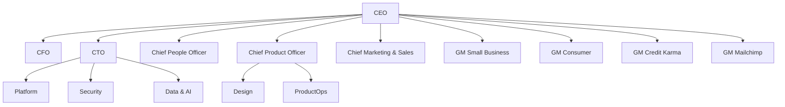

<Note>
  Names below are illustrative for this internal KB template. Replace with current leadership before publishing.
</Note>

## Executive Leadership Team (ELT)

The ELT meets every Monday and owns company-wide strategy.

| Role                                  | Name           | Slack handle  |
| ------------------------------------- | -------------- | ------------- |
| Chief Executive Officer               | Sasan Goodarzi | `@sasan`      |
| Chief Financial Officer               | Sandeep Aujla  | `@saujla`     |
| Chief Technology Officer              | Alex Balazs    | `@abalazs`    |
| Chief People Officer                  | Humera Shahid  | `@hshahid`    |
| Chief Product Officer                 | Mark Notarainni| `@mnotarainni`|
| Chief Marketing & Sales Officer       | Lara Balazs    | `@lbalazs`    |
| GM, Small Business & Self-Employed    | David Talach   | `@dtalach`    |
| GM, Consumer Group                    | Mark Notarainni| `@mnotarainni`|
| GM, Credit Karma                      | Kenneth Lin    | `@klin`       |
| GM, Mailchimp                         | Rania Succar   | `@rsuccar`    |

## Org structure

## Skip-level expectations

- **Director and above** must hold a 1:1 with each direct report at least every two weeks.
- **VP and above** must run a skip-level with each L+2 report at least once a quarter.
- See [Performance reviews](/people/performance-reviews) for cadence rules.

## Board of Directors

Board composition is documented in our [10-K](https://investors.intuit.com). New hires can request the latest proxy statement from `legal-confidential@intuit.example`.

## Owner

Office of the CEO · `eo-staff@intuit.example`
