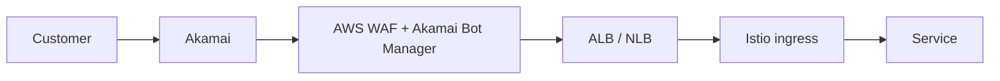

## Edge

Customer traffic enters Intuit through **Akamai** (CDN + WAF) and lands at our **Application Load Balancers** in front of EKS.

Akamai gives us:

- Anycast presence near customers globally
- L7 DDoS mitigation, bot management
- TLS termination (we also re-terminate at Istio for E2E)
- Static asset caching

## VPCs

Each AWS account has 1-3 VPCs:

- **app-vpc** — service workloads
- **data-vpc** — databases, OLAP
- **shared-svc-vpc** — internal-only utilities (CI runners, bastions)

VPCs are connected via **AWS Transit Gateway** in a hub-and-spoke topology, enforced by network teams. No service-team VPCs are peered directly.

## Egress

Outbound internet from production services:

- All egress flows through dedicated **NAT gateways** with allowlists
- Allowlists are managed via the `intuit-egress` repo, owned by Network Security
- New external dependencies require an egress-rule PR + security review

## DNS

- **External DNS**: `intuit.com`, `quickbooks.com`, `creditkarma.com`, `mailchimp.com` — managed in Route 53 by the DNS team
- **Internal DNS**: `svc.intuit-internal` — managed by service mesh (Istio) and CoreDNS
- Service-to-service hostname format: `<service>.<namespace>.svc.intuit-internal`

## mTLS

Every service-to-service call inside ICP is mTLS via Istio. Certs come from Vault PKI, rotate every 24 hours.

## Service mesh policies

Default policies on the mesh:

- **Default-deny** all cross-namespace traffic
- **Explicit allows** declared via `service.yaml` `dependencies`
- **Rate limits** per caller
- **Retries** with exponential backoff (3 retries, 100ms-1s)
- **Circuit breaking** based on error rate

## Owner

Network Engineering · `netops@intuit.example`
