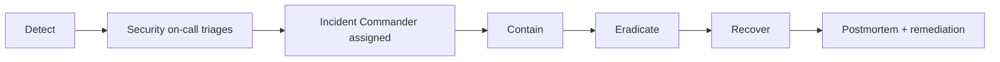

If you suspect a security incident, **page the security on-call immediately**. Don't wait to confirm. False alarms are cheap; delayed response is expensive.

## Page security on-call

Three ways to page:

1. PagerDuty — page `security-incident-response`
2. Slack — `/sec-incident` slash command
3. Phone — 1-800-INTUIT-SEC, 24/7

State concisely: what you observed, when, what's affected, what you've already done.

## What counts as a security incident

- Unauthorized access (or potential)
- PII or credential leak (committed to public repo, sent in plaintext, etc.)
- Active exploitation of a vulnerability
- Insider threat indicators (mass downloads, off-hours access spikes)
- Phishing campaign hitting employees
- Compromised credentials (yours or someone else's)
- DDoS or extortion attempt
- Compliance event (e.g., notifications-class miss → potential GDPR notification trigger)

When in doubt, page. We don't blame people for paging.

## Severity

| Severity | Definition                                                        | Examples                                          |
| -------- | ----------------------------------------------------------------- | ------------------------------------------------- |
| SEC-1    | Active breach or imminent risk to customer data / funds           | RCE in prod, credentials in public repo           |
| SEC-2    | Significant exposure, contained or reactive                       | Internal data leak, single-customer compromise    |
| SEC-3    | Vulnerability or risk indicator, no exploitation                  | New CVE in prod dep, suspicious alert spike       |
| SEC-4    | Hygiene / minor                                                   | Minor misconfiguration, low-impact phishing       |

## The IR process

The Incident Commander runs the response. Service teams contribute domain expertise. Comms team handles internal/external messaging if needed.

## Containment first

Default playbook for confirmed exposure:

1. **Rotate** — credentials, keys, tokens. Don't try to determine if they were used; assume yes.
2. **Revoke** — sessions, OAuth grants, API keys.
3. **Quarantine** — isolate affected hosts, accounts, services.
4. **Preserve** — snapshot logs, disks, memory before changes.
5. **Communicate** — IC owns this. Don't tell anyone outside the IR channel without IC approval.

## Don't

- Don't tell customers, vendors, or press without IC approval.
- Don't post in public channels or send unencrypted emails about the incident.
- Don't wipe systems before forensics has snapshotted.
- Don't blame anyone — psychological safety is what makes good IR work.

## After the incident

Every SEC-1 and SEC-2 produces a postmortem within 5 business days. See [Postmortems](/engineering/oncall/postmortems). The Audit Committee reviews material incidents quarterly.

## Owner

Security Operations · `secops@intuit.example` · 24/7 hotline 1-800-INTUIT-SEC
