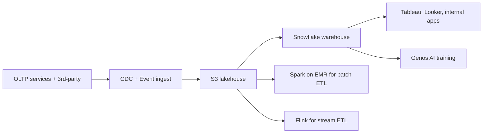

The Data Platform is our centralized data infrastructure: ingest, store, transform, query, and serve. It powers product analytics, financial reporting, ML training, and real-time decisioning.

## High level



## Components

| Component         | Tool              | Purpose                                              |
| ----------------- | ----------------- | ---------------------------------------------------- |
| Event ingest      | Kafka (MSK)       | Service-emitted events                               |
| CDC               | Debezium → Kafka  | Postgres → lakehouse                                 |
| Lakehouse         | S3 + Iceberg      | Open table format, immutable                         |
| Warehouse         | Snowflake         | Interactive analytics, federation                    |
| Stream processing | Flink             | Sub-second pipelines                                 |
| Batch processing  | Spark on EMR      | Daily/hourly aggregations                            |
| Orchestration     | Airflow           | DAGs scheduled and monitored                         |
| Catalog           | DataHub           | Metadata, lineage, data discovery                    |
| Quality           | Great Expectations| Data contracts and assertions                        |
| Notebooks         | Databricks + Hex  | Exploratory and shared analysis                      |

## Getting access

Snowflake roles map to Okta groups. Request access through the [Software catalog](/operations/it/software-catalog).

| Role               | What it gives you                                           |
| ------------------ | ----------------------------------------------------------- |
| `READER_ANALYST`   | Read access to common warehouses + analytics schemas        |
| `READER_FIN`       | Adds finance-restricted schemas (compensation, contracts)   |
| `WRITER_ETL`       | Write to engineering-owned schemas                          |
| `READER_PROD_PII`  | Read PII — requires manager + privacy approval              |

## Data contracts

Every event published to Kafka and every table written to the lakehouse must have a contract:

```yaml
# contracts/events/sbse.invoice.created.yaml
name: sbse.invoice.created
owner: team-invoicing@intuit.example
classification: pii_low
schema:
  type: object
  required: [invoice_id, tenant_id, amount_cents, currency, created_at]
  properties:
    invoice_id: {type: string, format: uuid}
    tenant_id: {type: string}
    amount_cents: {type: integer}
    currency: {type: string, pattern: '^[A-Z]{3}$'}
    created_at: {type: string, format: date-time}
sla:
  freshness: 1m
  availability: 99.9
```

Breaking contract changes require a major version bump and 30-day deprecation notice.

## Privacy

The lakehouse is the highest-risk data store at Intuit. Privacy controls:

- Tokenization of identifiers at ingest
- Column-level RBAC in Snowflake
- DSR (data subject request) tooling for GDPR / CCPA — see [Privacy](/operations/legal/privacy-gdpr-ccpa)
- Retention policies enforced via Iceberg compaction + Snowflake TTL

## Owner

Data Platform · `data-platform@intuit.example`
