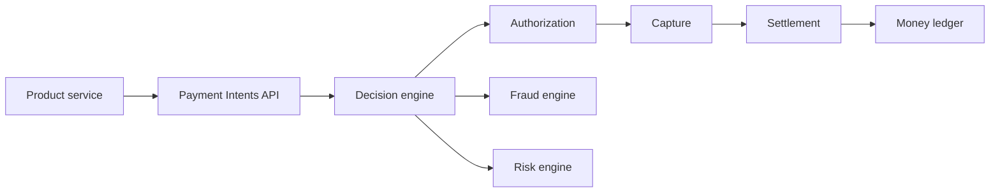

The Payments Platform is the money movement and processor layer used by every product that takes or sends money: QuickBooks Payments, TurboTax fees, Credit Karma Money, Mailchimp billing.

## Capabilities

- **Card acceptance** — credit and debit (Visa, MC, AMEX, Discover) via Stripe + first-party processor
- **ACH** — pull and push, NACHA-compliant
- **Wire** — domestic and international, FedWire and SWIFT
- **Real-time** — RTP and FedNow
- **Wallets** — Apple Pay, Google Pay, PayPal
- **International** — local rails (SEPA in EU, BACS in UK, EFT in CA, NPP in AU)
- **Disbursement** — payouts to bank accounts and instant card disbursement (push-to-card)

## Architecture (simplified)



## Calling the platform

```typescript
import { payments } from '@intuit/payments-client'

const intent = await payments.createIntent({
  amountCents: 12300,
  currency: 'USD',
  tenantId,
  customer: { id: customerId },
  paymentMethod: { type: 'card', token: 'pm_abc123' },
  capture: 'automatic',
  metadata: { invoiceId: 'inv_xyz' },
})
```

Idempotency is enforced via the `Idempotency-Key` header. Always set one — duplicate-charge bugs are the most common Sev-1 in this space.

## Compliance

The platform is the **only** place card data lives in Intuit. Other services never see PANs.

- **PCI DSS Level 1** — annual external audit
- **Tokenization** at edge: PANs become tokens before any service-to-service hop
- **Network segmentation** — payments services in a dedicated VPC with restricted egress
- **PII redaction** — see [Data classification](/engineering/security/data-classification)

## SLOs

T0 service. Targets:

- 99.99% authorization-success availability (excluding card-issuer declines)
- p99 < 350ms end-to-end intent → authorization
- 99.999% durability of completed transactions
- Zero loss of funds to Intuit, ever

## On-call

Payments runs a follow-the-sun rotation across MV / ATL / BLR / TLV. Sev-1 paging within 5 minutes 24/7. See [Severity levels](/engineering/oncall/severity-levels).

## Owner

Payments Platform · `payments-platform@intuit.example`
