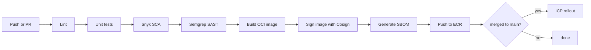

## The pipeline

We use **GitHub Actions** for CI and **ICP Deploy** for CD. Every service repo includes a generated `.github/workflows/icp.yml` from the [Service catalog](/engineering/services/service-catalog) template.



## Required checks

Every service must have these checks pass before merge:

- Unit tests with line coverage threshold (80% for new code)
- SCA (Snyk) — no high or critical vulnerabilities
- SAST (Semgrep) — Intuit-tuned ruleset
- Container scan (Trivy) on built image
- License check (FOSSA) — no GPL or AGPL in service code
- API contract test (if service exposes a public/internal API)

## Build-and-deploy SLAs

| Stage                    | Target time    | Action if exceeded                 |
| ------------------------ | -------------- | ---------------------------------- |
| PR check (full pipeline) | < 15 min       | DevX team paged                    |
| Merge to dev deploy      | < 10 min       | Service team alerted               |
| Dev → staging            | < 5 min        | —                                  |
| Staging → prod canary    | < 30 min       | Manual approval after staging gate |
| Canary → 100%            | 60 min default | Auto-progress unless SLO regresses |

## Rollbacks

Rollback is one command:

```bash
intuit deploy rollback <service> --env prod
```

By default this rolls back to the previous version. To roll forward to a specific version:

```bash
intuit deploy promote <service> --env prod --version v1.42.0
```

ICP keeps the last 10 versions hot for instant rollback. Rollback never requires a build.

## Promotion gates

Every promotion has a gate. Standard gates:

| Gate              | Auto check                              | Bypass authority             |
| ----------------- | --------------------------------------- | ---------------------------- |
| dev → staging     | Smoke tests pass                        | Service tech lead            |
| staging → canary  | Integration suite, load test            | Service tech lead            |
| canary → 100%     | SLO checks (latency, error rate)        | Service tech lead + on-call  |

Bypassing a gate is logged and audited. Repeat bypasses trigger a review with engineering leadership.

## Owner

DevX + ICP Platform · `devx@intuit.example`
