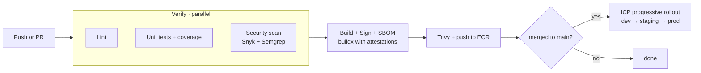

## The pipeline

We use **GitHub Actions** for CI and **ICP Deploy** for CD. Every service repo includes a generated `.github/workflows/icp.yml` from the [Service catalog](/engineering/services/service-catalog) template.



The verify stage runs in parallel — a failure in any job fails the PR fast without waiting for the others.

## Required checks

A single `ci/verify` status check rolls up the following. All must pass before merge:

- Unit tests, 80% line coverage on new code
- Security: Snyk SCA (no high/critical), Semgrep SAST (Intuit ruleset), Trivy image scan
- License check (FOSSA) — no GPL/AGPL in service code
- API contract test (services exposing a public or internal API)

Individual job logs are still available; the rollup keeps branch protection rules to one entry per service.

## Build-and-deploy SLAs

| Stage                          | Target         | If exceeded                        |
| ------------------------------ | -------------- | ---------------------------------- |
| PR check (full verify + build) | < 8 min        | DevX paged                         |
| Merge to dev                   | < 5 min        | Service team alerted               |
| Dev → staging                  | < 3 min        | —                                  |
| Staging → prod canary          | < 15 min       | Manual approval after staging gate |
| Canary → 100%                  | 30 min default | Auto-progress unless SLOs regress  |

End-to-end merge-to-prod-canary target: **20 minutes**.

## Rollbacks

One command:

```bash
intuit deploy rollback <service> --env prod
```

Rolls back to the previous version. To pin a specific version:

```bash
intuit deploy promote <service> --env prod --version v1.42.0
```

ICP keeps the last 10 versions hot. Rollback never requires a build.

## Promotion gates

| Gate              | Auto check                                  | Bypass authority                                  |
| ----------------- | ------------------------------------------- | ------------------------------------------------- |
| dev → staging     | Smoke tests pass                            | Auto on green                                     |
| staging → canary  | Integration suite + load test               | Service tech lead                                 |
| canary → 100%     | SLO checks (latency, error rate, saturation) | Auto unless regression; lead + on-call to override |

Bypasses are logged and audited. Three or more bypasses in a rolling 30-day window trigger a review with engineering leadership.

## What changed in this revamp

- **Verify stage parallelized.** Lint, tests, and security scans now run concurrently. Old pipeline ran them sequentially.
- **Single build step.** Image build, Cosign signing, and SBOM generation now happen in one `buildx` invocation using build attestations. Three jobs collapsed into one.
- **One security status check.** Snyk + Semgrep + Trivy roll up into `ci/verify` instead of three separate required checks. Branch protection is simpler; coverage is the same.
- **Auto-promote dev → staging.** Removed manual gate; smoke tests gate is sufficient.
- **Tighter SLAs.** PR check 15 → 8 min. Merge-to-prod-canary roughly 45 → 20 min.

## Owner

DevX + ICP Platform · `devx@intuit.example`
