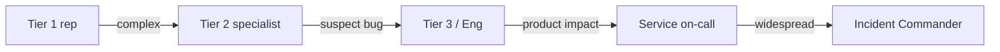

Most customer issues resolve at Tier 1. The ones that don't take the path below.

## Tier escalation

## When to engage engineering

Engineering gets involved when support has:

- Confirmed reproducible behavior
- Ruled out user error
- Verified the customer's account state matches what they describe
- Captured logs, request IDs, screenshots

Tier 3 reps know what evidence engineering needs. Don't escalate without it — it just bounces back.

## Severity triage

When a case escalates to engineering, Tier 3 assigns a severity:

| Severity | Trigger                                                                   |
| -------- | ------------------------------------------------------------------------- |
| C-1      | Many customers affected, significant business impact                       |
| C-2      | Multi-customer, narrow                                                     |
| C-3      | Single customer, important to that customer                                |
| C-4      | Single customer, low impact (cosmetic)                                     |

C-1 escalations trigger an engineering sev-1 review within 30 minutes. Most don't end up being engineering sev-1, but the response speed matters.

## Customer comms during escalation

- Tier 1/2 rep stays the customer-facing voice
- Engineering does NOT contact customers directly except in rare cases (high-touch enterprise customer + product approval)
- Updates flow back to the customer through the rep
- For widespread issues, the [Status page](https://status.intuit.example) and an in-product banner are primary channels

## Special channels

- **Executive escalations** (CEO/CFO inbox, BBB complaints, regulatory inquiries): handled by `exec-relations@intuit.example`
- **Press / social media spike**: looped to [Press policy](/operations/comms/press-policy) team
- **Legal threats**: routed to Legal — no rep response without Legal's input
- **Suspected fraud / abuse**: handed to Trust & Safety per product

## Post-resolution

After every C-1 / C-2:

- Root cause documented in the case
- Knowledge base updated if there's a self-serve solution
- Pattern detected? File a Jira for the product team
- If postmortem-worthy, see [Postmortems](/engineering/oncall/postmortems)

## Owner

Customer Care Operations · `cc-ops@intuit.example`
