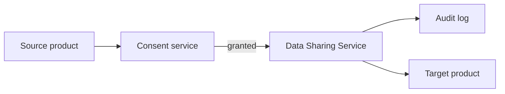

Cross-product data sharing is the wedge for the "connect ecosystem" strategic priority. Done well, it makes Intuit feel like one product. Done poorly, it's a privacy disaster.

## What we share, with whose consent

The default is **explicit, per-flow customer consent**. We don't share data between products without the user opting in for that specific use.

## Common flows

### QuickBooks → TurboTax

QBO Self-Employed customers can carry their year's books into TurboTax with one click. The user explicitly approves; we transfer:

- Schedule C-relevant income and expenses
- Mileage logs
- 1099s issued (and received from clients)

### TurboTax → Credit Karma

TurboTax customers can opt to share refund estimates with Credit Karma to see Refund Advance offers. Data shared:

- Estimated refund amount
- Filing status
- Federal AGI (for offer matching)

### Credit Karma → TurboTax

Credit Karma members can opt to use TurboTax for tax prep with pre-fill from CK profile data. Data shared:

- Address, name (already in CK profile)
- Linked bank account routing for direct deposit

### QuickBooks → Mailchimp

QBO + Mailchimp bundle customers can sync customer data and purchase history into a Mailchimp audience. Data shared (with consent):

- Customer names and contact info
- Purchase history (for segmentation)
- Invoice status for transactional triggers

### Mailchimp → QuickBooks

Mailchimp customers running an e-commerce store can send purchase records into QuickBooks for accounting. Data shared:

- Order data (totals, line items, taxes)
- Customer payment status

## How it's plumbed

Cross-product data flows through a dedicated **Data Sharing Service** that:

- Enforces consent (no sharing without an explicit grant)
- Logs every share for audit (DSR-compliant)
- Applies the receiving product's data classification rules
- Honors revocation (withdraw consent → stop sharing forward)

## Privacy controls

- **Granular consent** — by data category, by destination, with expiration
- **Revocation** — instant; followed by deletion in target if user requests
- **Audit trail** — every share is logged with consent context
- **Data minimization** — share only fields the receiving flow needs

## Compliance

- **GDPR** — explicit consent, right to revoke, right to erasure flow through
- **CCPA** — sale-of-data prohibitions; sharing for service provision is allowed
- **GLBA / FCRA** — extra controls for financial data
- **HIPAA** — not applicable to most flows; relevant for QBO healthcare-billing customers

## Owner

Cross-Product Platform · `cross-product@intuit.example`
