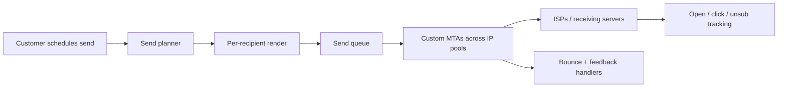

Mailchimp's deliverability is its #1 competitive moat. We've spent decades building reputation, infrastructure, and abuse-prevention practices. The result: when Mailchimp customers send via us, ISPs deliver to inboxes — not spam folders.

## Send infrastructure

## IP pools and reputation

We operate hundreds of IP addresses across multiple pools:

- **Premium / dedicated** — for paying customers requesting their own IPs
- **Shared by tier** — separate pools for free, essentials, standard, premium
- **Throttled / new sender** — for new accounts proving themselves
- **Quarantine** — accounts with reputation issues

Each pool is monitored for inbox placement, complaint rates, and ISP feedback.

## Throttling and warmup

When a customer sends to a new domain (e.g., a new gmail.com bulk send) or from a new IP, we ramp throughput gradually. Hitting a Gmail server with 10M emails out of the gate triggers spam filters; ramping over hours/days respects ISP signals.

## Authentication

Every campaign is signed with:

- **SPF** — IP-based authorization, set up at the sending domain
- **DKIM** — cryptographic signature, set up via DNS records
- **DMARC** — alignment policy + reporting

We push customers strongly toward DKIM and DMARC alignment. Non-aligned domains get worse delivery.

## Bounce handling

| Bounce type      | Handling                                            |
| ---------------- | --------------------------------------------------- |
| Hard bounce      | Address suppressed permanently                      |
| Soft bounce      | Retry up to N times across hours                     |
| Block (4xx auth) | Investigate, often a customer DNS issue             |
| Complaint (FBL)  | Address suppressed, reputation impact               |
| List-unsubscribe | Honored within minutes                              |

## Deliverability metrics

Customers see these in the platform:

- Inbox placement (where Litmus + ISP postmaster tools confirm landing)
- Open rate (with Mail Privacy Protection caveats)
- Click rate
- Complaint rate
- Bounce rate

Internal metrics include deeper signals: feedback loops, spam trap hits, IP reputation by region.

## Abuse and compliance

Bad actors using Mailchimp for spam, phishing, or scams degrade everyone's deliverability. Abuse team:

- Monitors signup signals (suspicious payment, mass list import, etc.)
- Honors abuse@ reports
- Auto-suspends accounts above complaint thresholds
- Reviews appeals

CAN-SPAM, CASL (Canada), GDPR (EU/UK), ASTRA (Australia) all apply.

## Owner

Deliverability Engineering · `deliverability@mailchimp.com`
