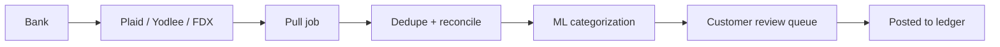

Banking feeds are the #1 cited feature by QBO customers — and the #1 reliability complaint. Money is real, banks are unreliable, and the gap between them is where we work.

## Connection methods, ranked

| Method               | Reliability | Coverage                  | Direction               |
| -------------------- | ----------- | ------------------------- | ----------------------- |
| Direct via FDX       | High        | ~150 large U.S. banks     | Pull (read-only)        |
| Plaid (OAuth-first)  | High        | ~12,000 institutions      | Pull (read-only)        |
| Yodlee (legacy)      | Medium      | ~14,000 institutions      | Pull (read-only)        |
| Manual import (.qfx) | Low         | Anyone                    | Customer-driven         |

We're migrating off Yodlee toward Plaid + FDX for new connections; Yodlee remains for some customers whose banks don't yet support FDX or OAuth-Plaid.

## Pulling, deduping, posting

- **Pull**: every 4 hours for active feeds; on-demand triggered by customer
- **Dedup**: bank transactions can arrive twice (pending + posted, retries, reordering); we dedupe on (account, amount, date, description) with fuzzy match
- **Categorize**: Genos-powered classifier suggests categories; customer can accept, edit, or set rules
- **Posted**: a journal entry hits the ledger

## Common failure modes

- **Bank changes login flow** — multi-factor changes break OAuth-less aggregators; the team's #1 firefight
- **Pending vs posted** — pending transactions can be reversed by the bank without notice
- **Date drift** — banks post transactions with future-dated effective dates around month-end
- **Manual edits clobbered** — customer edits a description, then re-fetch overwrites; protected by edit flags

## SLOs

| Metric                                | Target                  |
| ------------------------------------- | ----------------------- |
| Connection success                    | > 99% across all banks  |
| Daily pull freshness                  | 6h (most), 24h (worst)  |
| Categorization accuracy (auto-accept) | > 92%                   |
| Customer-blocked-by-feed              | < 0.5% of MAU           |

## Roadmap notes

- FDX expansion to more Canadian and European banks
- AI categorization improvements (per-customer fine-tuning)
- Real-time push (webhooks-based) for FDX-supporting banks

## Owner

Banking Feeds · `banking-feeds@intuit.example`
