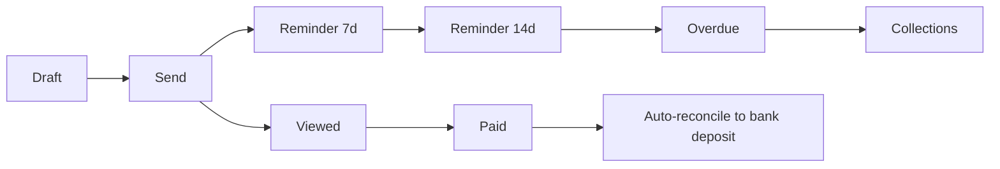

Invoicing is the highest-volume customer-facing flow in QuickBooks. Every QBO realm uses it.

## Lifecycle

## Capabilities

- **Templates** — branded, customizable, multi-language
- **Line items** — products, services, hours, mileage; pulled from Items master
- **Sales tax** — automatic by jurisdiction via the sales-tax service
- **Multi-currency** — exchange rate at issue date
- **Recurring** — template + schedule (weekly, monthly, quarterly)
- **Estimates → invoice** — convert with one click
- **Payments link** — invoice email links to a hosted pay page (card, ACH, Apple/Google Pay)
- **Reminders** — automated, customizable
- **Customer portal** — see all invoices, pay, download receipts

## Sending

Invoices are sent via the [Notifications platform](/engineering/services/notifications):

- Email (most common)
- SMS (opt-in)
- Customer portal (always available)

Email deliverability is critical — we use SPF, DKIM, DMARC with the customer's domain when verified, otherwise from a `quickbooks-mail.com` address.

## Payment integration

When the customer clicks "Pay" on an invoice email:

1. Routed to a hosted pay page (with optional embed in the customer's site)
2. PCI-compliant payment form
3. Authorization through [Payments platform](/engineering/services/payments-platform)
4. On capture, the invoice flips to "Paid", a payment is recorded in the [accounting engine](/products/quickbooks/accounting-engine), and the bank deposit is auto-reconciled when it lands

## Internal architecture

| Service                     | Role                                                  |
| --------------------------- | ----------------------------------------------------- |
| `invoice-service`           | CRUD, business logic, lifecycle                       |
| `invoice-pdf-renderer`      | Server-side PDF generation                             |
| `template-service`          | Template management and rendering                      |
| `recurring-engine`          | Schedules and dispatches recurring invoices            |
| `customer-portal-bff`       | API for the customer-facing portal                    |

## Common Sev-3 patterns

- **PDF render slow** — usually a font load or template-loop edge case
- **Recurring not firing** — timezone misconfiguration on the realm
- **"Paid" but bank deposit unmatched** — bank feed delay, auto-reconcile retries

## Owner

Invoicing Team · `invoicing@intuit.example`
