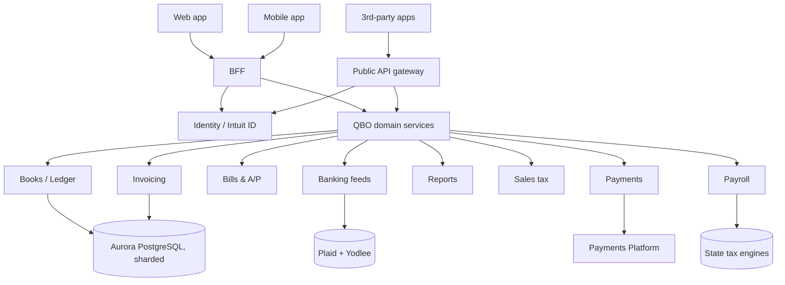

A simplified view of QBO's runtime topology. Mostly accurate; some boxes are conceptual (a single "service" here may be 10 services in reality).

## Runtime

## BFF (Backend for Frontend)

A Node.js layer that aggregates domain-service calls into screen-level responses. Every QBO web page corresponds to a small handful of BFF endpoints. Lets domain services stay generic while UX iterates fast.

## Public API

Customer-built integrations consume the **QuickBooks API** at `developer.intuit.com`. OAuth 2.0 + PKCE. Rate limits per app + per realm.

We treat this API as a contract. **Breaking changes are forbidden** without a multi-quarter deprecation cycle and customer outreach.

## Sharding

Aurora is sharded by realm. ~50 shards in production. Realms are pinned to shards based on creation hash + load.

Cross-shard queries happen in the **Reports** service via Snowflake — operational queries use the warehouse for cross-realm aggregates (with full anonymization for any cross-tenant analytics).

## Eventing

Internal events fan out via Kafka. Common event topics:

- `qbo.invoice.created`, `qbo.invoice.paid`
- `qbo.bank-txn.imported`, `qbo.bank-txn.categorized`
- `qbo.payroll.run-completed`
- `qbo.entitlement.changed`

Apps and partners subscribe via webhooks proxied through the public API.

## Critical paths to understand

- **Login → Home dashboard**: hits ~12 services, < 800ms p95 SLO
- **Add invoice → save**: hits 5 services, < 500ms p95
- **Bank feed sync**: async, expected to settle within 6 hours of bank posting

## Where it could be better

We're refactoring:

- The Reports service away from synchronous joins toward materialized views in Snowflake
- The Banking service away from direct Yodlee toward Plaid for new accounts (in-flight)
- The mobile-web bridge — too many platform-specific paths in shared code

## Owner

QBO Engineering · `qbo-eng@intuit.example`
