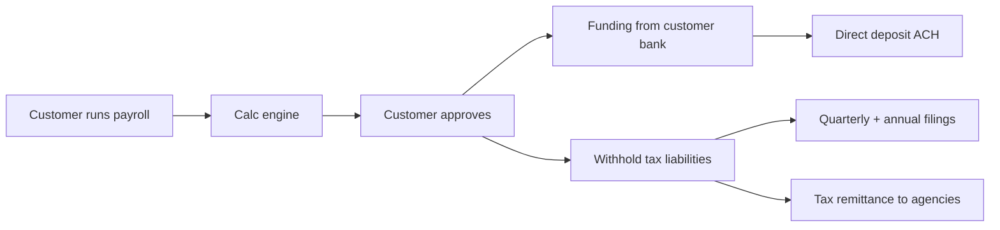

Payroll is one of the most complex products at Intuit. We compute and remit taxes for every U.S. state, ~10,000 local jurisdictions, plus support international payroll in CA, UK, AU.

## Tiers

| Tier      | Highlights                                                  |
| --------- | ----------------------------------------------------------- |
| Core      | DIY payroll, federal/state filings included                 |
| Premium   | Same-day direct deposit, HR support, workers' comp admin    |
| Elite     | Tax penalty protection, dedicated HR pro, certified payroll |

## Big-picture flow

## Calc engine

The payroll calc engine computes:

- Gross-to-net for each employee
- Employer payroll taxes (FICA, FUTA, SUTA, local)
- Pre-tax and post-tax deductions (401(k), HSA, garnishments)
- Workers' comp premium calculations
- Multi-state withholding (employees who work across states)

Federal rules update once a year. State rules update **constantly** — sometimes mid-year. The "rules content" pipeline is run by a dedicated team and ships to prod weekly during legislative seasons.

## Tax filing

We file:

- Federal 941 (quarterly), 940 (annual), W-2 (annual)
- State income tax withholding returns (varies, monthly to annual)
- State unemployment (quarterly)
- New hire reporting
- Local jurisdictions

Filings are submitted electronically. The few states/locals that require paper filings are handled by an internal mail-fulfillment partner.

## Tax remittance

We pull funds from the customer's bank account, hold briefly in a customer trust account, and remit to taxing authorities by their due dates. This is a regulated activity in many states (we hold money on the customer's behalf).

The trust account is **never** commingled with Intuit operating funds. Treasury controls are reviewed annually as part of SOC 2.

## Penalty protection

In the Elite tier, if Intuit's payroll product makes an error that results in a tax penalty, **we pay it**. This requires:

- Strict internal controls on rules content updates
- Strong reconciliation between calc and remittance
- Customer must follow our recommended timeline

## Failure modes that scare us

- Funding NSF — customer bank rejects ACH; deposits already issued
- Late remittance — penalty risk
- Misclassification — wrong tax bracket or exempt status
- Bank routing changes — direct deposit returns

## Owner

Payroll Engineering · `payroll-eng@intuit.example`
