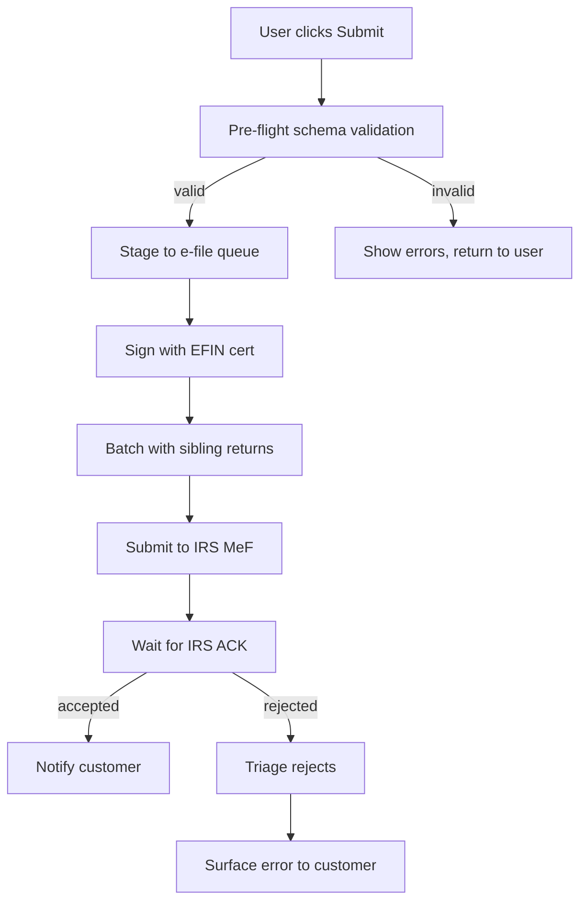

E-file is the path from "Submit" to a federal acknowledgment. Reliability of this pipeline is **the** number-one TurboTax engineering objective during peak season.

## End-to-end flow

## SLAs

| Step                       | Target                                          |
| -------------------------- | ----------------------------------------------- |
| Pre-flight validation      | < 2 seconds                                     |
| Submission to IRS          | Within 15 minutes of customer click             |
| ACK from IRS               | Median ~30 min, p95 ~2 hours, hard cap 48 hours |
| Customer notification      | Within 5 minutes of ACK                         |

The 15-minute submission target gives us room to batch — the IRS prefers batched submissions and we get higher throughput that way.

## IRS submission protocol

We use **IRS MeF (Modernized e-File)** XML schemas, version 1.0+. Every submission includes:

- The return XML (compressed, signed)
- Our **EFIN** (Electronic Filing Identification Number) — proves we're an authorized provider
- An origin manifest with submission timestamp, batch ID

Reject codes are well-documented; common ones include `IND-031` (PIN doesn't match), `R0000-902` (return already filed under this SSN), `F1040-525` (dependent already claimed). Each maps to a customer-friendly explanation in our error catalog.

## Backpressure handling

The IRS accepts submissions 24/7 but throttles aggressively. Our queue handles backpressure in three layers:

1. **In-memory queue** per submission worker
2. **Redis queue** for cross-worker coordination
3. **SQS** durable queue for resubmissions

If the IRS is slow or down, we hold customer submissions and continue accepting "submit" clicks — customers see "transmitting to IRS, we'll email you when accepted." We've never lost a submission.

## State e-file

Every state has different rules. Some piggyback on federal e-file (we send both federal and state in one packet); others require separate submissions. The `state-efile` service abstracts this.

## Peak day capacity

April 15 evening is the highest-throughput hour of any system at Intuit, by an order of magnitude. The pipeline is provisioned for **10× normal peak** during the last 72 hours of season.

## Owner

E-file team · `efile@intuit.example`
