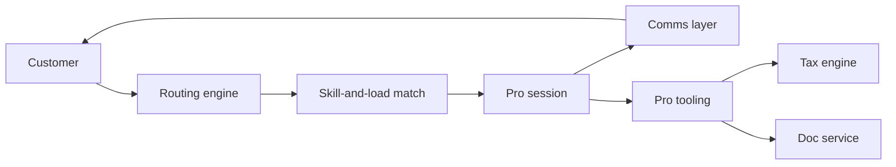

The Live Experts platform powers TurboTax Live Assisted and Live Full Service. It's the engineering layer behind real-time customer-to-expert connection.

## Product surfaces

- **Live Assisted** — DIY customer can call/chat/video with a pro for help
- **Live Full Service** — Customer hands off; pro prepares the return end-to-end
- **Pro experience** — Tools the tax pros use to triage, work cases, and review

## Capabilities

| Capability             | What it does                                                 |
| ---------------------- | ------------------------------------------------------------ |
| Routing                | Match customer to pro by domain, language, certification     |
| Communication          | One-way and two-way video, async chat, screenshare           |
| Document exchange      | Secure upload, review, and signature                         |
| Workflow               | Pro-side queues, time tracking, escalation                   |
| Quality                | QA review of pro work; sample-based                          |
| Compensation           | Time-tracked pay, surge bonuses, performance ratings         |

## Architecture (high level)

The routing engine is the most performance-critical piece — sub-second match-to-pro is the customer's first impression of "expert help."

## Pro tooling

Pros work in a custom UI built on Trips, optimized for keyboard navigation and high information density. Key surfaces:

- Customer return view (read-write, all forms)
- Side-by-side chat / video panel
- Document drawer with type-aware previews
- Q&A interview replay (what the customer told us)
- Knowledge base — internal-only, written by the most senior pros

## Identity and trust

Pros are background-checked, tax-credential-verified (CPA, EA, tax attorney), and complete annual Intuit-internal certification on TurboTax tooling, IRS Pub 1075 controls, and customer experience.

Pro access to customer data is **session-scoped**: a pro only sees a customer's return while actively working it. Audit logs every read.

## Capacity

- Off-season baseline: ~500 pros, mostly internal full-timers and senior contractors
- Peak: ~5,000 pros, blend of W-2 employees and 1099 contractors
- Capacity scales weekly via the Workforce Management system

## Owner

Live Experts Engineering · `live-experts-eng@intuit.example`
